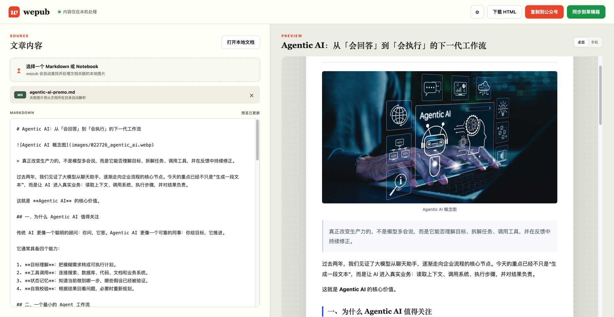
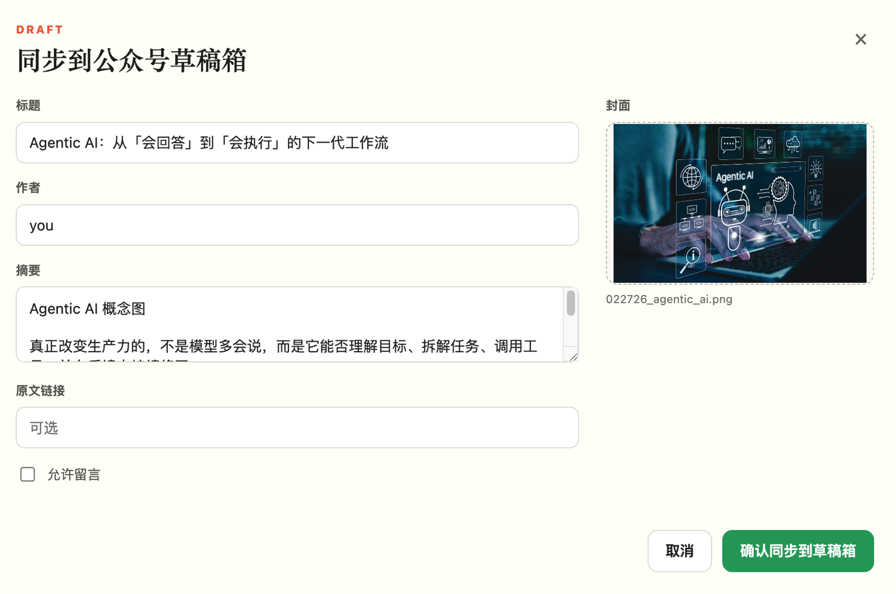

# wepub

<p align="center">
  <strong>把 Markdown 和 Jupyter Notebook，优雅地搬进微信公众号。</strong>
</p>

<p align="center">
  本地 Web 工作台 · 自动解析关联图片 · 实时预览 · 一键复制富文本 · 同步到公众号草稿箱
</p>

<p align="center">
  <a href="https://github.com/yauld/wepub/blob/main/LICENSE"></a>
  <a href="https://github.com/yauld/wepub/stargazers"></a>
</p>



## 为什么做 wepub？

技术文章通常写在 Markdown 或 Jupyter Notebook 里，但发布到微信公众号时，代码块、表格、图片和层级样式往往需要重新整理。

wepub 把这段重复劳动压缩成三个动作：

1. 选择一个 `.md` 或 `.ipynb` 文档；
2. 在浏览器中检查公众号效果；
3. 点击「复制到公众号」或「同步到草稿箱」。

文档和图片只在本机处理，不会上传到第三方服务。

wepub 尤其适合：

- 用 Markdown / Notebook 写技术文章的人；
- 经常在公众号里重排代码块、表格和图片的人；
- 想保留本地写作流，但又希望少碰公众号编辑器的人；
- 需要把 Notebook 教程、课程讲义或技术长文稳定发布到公众号的人。

## 功能

- Markdown 转微信公众号兼容的内联样式 HTML
- Jupyter Notebook Markdown、代码、文本输出和图片输出渲染
- 根据文档真实路径自动解析 `assets/...` 等本地关联图片
- Notebook attachment 图片支持
- SVG 自动通过本地 Chrome 转换成 PNG
- 标题、段落、列表、引用、代码块、表格和图片样式
- 桌面/手机宽度实时预览
- 一键复制富文本到微信公众号编辑器
- 通过微信官方 API 一键同步到公众号草稿箱
- 下载独立 HTML 预览文件
- 保留 CLI，方便脚本和自动化工作流调用

## 产品截图

wepub 的核心路径是：本地文档预览 → 确认草稿信息 → 进入公众号草稿箱。

| 本地预览 | 同步到草稿箱 | 微信草稿箱结果 |
| --- | --- | --- |
|  |  |  |

更多截图准备建议见 [docs/SCREENSHOTS.md](docs/SCREENSHOTS.md)。

## 快速开始

环境要求：

- Node.js 18 或更高版本
- macOS（Web 工作台的原生文档选择器）
- Google Chrome 或 Chromium（仅 SVG 转 PNG 时需要）

```bash
git clone https://github.com/yauld/wepub.git
cd wepub
npm install
npm run web
```

浏览器打开 <http://127.0.0.1:4173>，点击「打开本地文档」，选择 Markdown 或 Notebook 即可。文档引用的相对图片会从文档所在目录自动解析，无需逐张上传。

### 同步到微信公众号草稿箱

点击右上角设置按钮，填写公众号 AppID 和 AppSecret。凭据只发送到本机服务，
并保存在 macOS Keychain，不会写入项目文件或返回给浏览器。

连接成功后：

1. 预览并确认文章；
2. 点击「同步到草稿箱」；
3. 填写标题、作者和摘要，选择封面；
4. 确认同步。

wepub 会自动：

- 使用稳定版接口调用凭据；
- 将正文图片转换为微信支持的 JPG/PNG，并上传到微信；
- 将封面压缩为微信缩略图并上传为永久素材；
- 创建普通图文草稿（`article_type: news`）；
- 再次获取草稿详情，验证标题和正文已成功写入。

需要提前在微信开发者平台启用 AppSecret，并将本机公网出口 IP 加入 API IP 白名单。
wepub 只创建草稿，不会自动发表或群发。

接口版本与限制记录见 [docs/WECHAT_API.md](docs/WECHAT_API.md)。

### 隐私与安全

- 默认只监听 `127.0.0.1`，不是公网服务。
- AppID / AppSecret 只发送到本机服务，并保存到 macOS Keychain。
- 配置状态接口只返回是否已配置和 AppID 尾号，不返回 AppSecret。
- 只有点击「确认同步到草稿箱」后，正文图片、封面和文章内容才会上传到微信官方 API。
- wepub 只创建草稿，不会自动发表或群发。

### CLI

```bash
node ./bin/wepub.mjs "/path/to/article.md" --out ./dist/article
```

也可以注册为本地命令：

```bash
npm link
wepub "/path/to/notebook.ipynb" --out ./dist/article
```

输出文件：

- `article.html`：可以嵌入编辑器的文章正文
- `preview.html`：带富文本复制按钮的独立预览
- `meta.json`：标题、来源、校验值和转换警告

## 图片目录示例

```text
my-article/
├── article.ipynb
└── assets/
    ├── architecture.svg
    └── result.png
```

只需要选择 `article.ipynb`。wepub 会自动找到两张图片、处理 SVG，并将图片和正文一起渲染。

## 工作原理

```text
本地文档选择器
      │
      ▼
读取 Markdown / Notebook ──► 解析本地图片与 Notebook 输出
      │
      ▼
生成内联样式 HTML ──► 实时预览 ──► 复制到公众号 / 下载 HTML
                         │
                         └──► 上传正文图片 / 封面 ──► 创建公众号草稿
```

Web 工作台和 CLI 共用同一套转换核心。本地服务使用 Node.js 标准 HTTP 模块，没有引入重量级 Web 框架。

## 当前边界

- Web 原生文档选择器目前优先支持 macOS；其他系统可以先使用 CLI。
- 草稿同步需要公众号 AppID、AppSecret、API 权限和 IP 白名单。
- wepub 只调用微信官方 API 创建草稿，不会模拟登录公众号后台。
- wepub 不会自动发表文章；发布仍需要在公众号后台人工确认。
- 微信公众号编辑器可能调整粘贴规则；遇到兼容问题欢迎提交 Issue，并附上最小复现文档。

## Roadmap

- [ ] Windows / Linux 原生文档选择
- [ ] 多套公众号主题和可视化主题编辑
- [ ] 代码语法高亮
- [x] 正文图片和封面自动压缩到微信限制内
- [ ] npm 安装和一键启动
- [x] 微信公众号草稿 API 集成
- [ ] GitHub Action / 批量转换

## 参与贡献

Bug、兼容性案例、主题设计和功能建议都很欢迎。开始前请阅读 [CONTRIBUTING.md](CONTRIBUTING.md)。

如果这个项目让你的发布流程轻松了一点，欢迎点一个 ⭐。它会帮助更多写技术公众号的人发现 wepub。

## License

[MIT](LICENSE)
