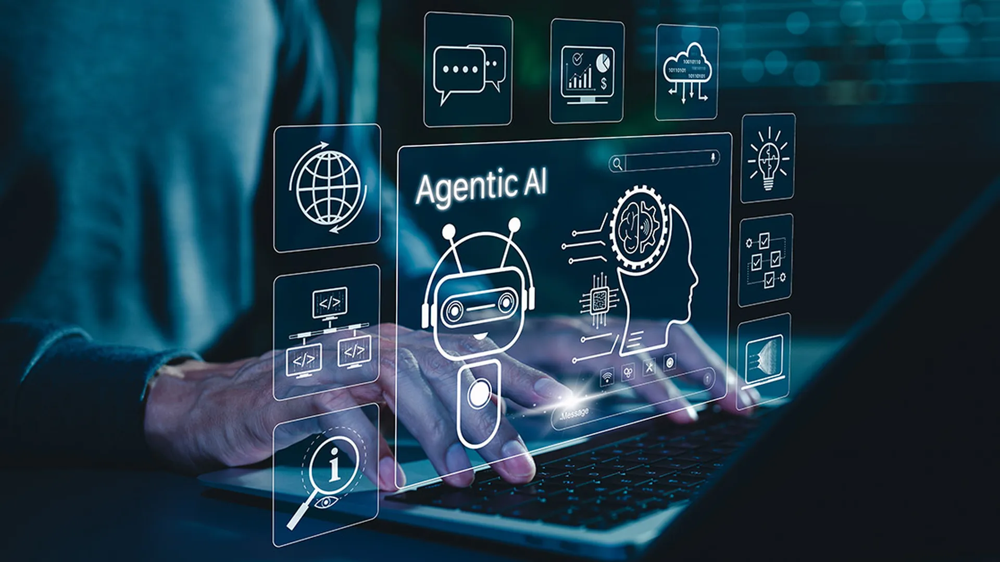

# Agentic AI：从「会回答」到「会执行」的下一代工作流



> 真正改变生产力的，不是模型多会说，而是它能否理解目标、拆解任务、调用工具，并在反馈中持续修正。

过去两年，我们见证了大模型从聊天助手，逐渐走向企业流程的核心节点。今天的重点已经不只是“生成一段文本”，而是让 AI 进入真实业务：读取上下文、调用系统、执行步骤，并对结果负责。

这就是 **Agentic AI** 的核心价值。

## 一、为什么 Agentic AI 值得关注

传统 AI 更像一个聪明的顾问：你问，它答。Agentic AI 更像一个可靠的同事：你给目标，它推进。

它通常具备四个能力：

1. **目标理解**：把模糊需求转成可执行计划。
2. **工具调用**：连接搜索、数据库、代码、文档和业务系统。
3. **状态记忆**：知道当前做到哪一步，哪些假设已经被验证。
4. **自我校验**：根据结果回看问题，必要时重新规划。

## 二、一个最小的 Agent 工作流

下面是一个极简示例：Agent 先判断用户意图，再决定是否调用工具。

```python
from dataclasses import dataclass


@dataclass
class Task:
    goal: str
    context: str


def plan(task: Task) -> list[str]:
    return [
        "理解目标与约束",
        "检索相关资料",
        "生成初版方案",
        "校验输出质量",
        "交付最终结果",
    ]


task = Task(
    goal="把一篇技术文章发布到公众号草稿箱",
    context="需要保留图片、代码块和排版结构",
)

for step in plan(task):
    print("→", step)
```

输出并不复杂，但它体现了 Agentic AI 最关键的思维方式：**不是一次性生成答案，而是围绕目标组织行动链路**。

## 三、从内容生产看 Agentic AI

以技术文章发布为例，传统流程往往要经历：

- 在 Markdown 或 Notebook 中写作；
- 手动整理图片路径；
- 复制到编辑器后重新排版；
- 检查代码块、表格和引用是否错乱；
- 反复预览，最后保存草稿。

Agentic AI 可以把这些动作变成一条自动化链路：

| 阶段 | 人类关注点 | Agent 可以承担的工作 |
| --- | --- | --- |
| 写作 | 内容是否完整 | 检查结构、补齐摘要、生成标题建议 |
| 转换 | 样式是否稳定 | 处理代码块、表格、图片和引用 |
| 发布 | 是否符合平台规则 | 上传图片、创建草稿、校验结果 |
| 复盘 | 哪些地方可优化 | 总结发布问题，沉淀模板 |

## 四、真正的壁垒：可靠性

Agentic AI 的难点不在“看起来聪明”，而在“长期稳定”。

```text
目标输入
  │
  ▼
任务规划 ──► 工具调用 ──► 结果校验
  ▲                         │
  └──────── 反馈修正 ◄───────┘
```

一个好的 Agent 系统，需要把每一步都设计成可观察、可恢复、可验证。尤其在真实业务里，失败不可怕，**不可解释的失败才可怕**。

## 五、结语

Agentic AI 不是把人替换掉，而是把人从重复劳动里解放出来。

人负责判断方向、定义标准、做最终取舍；AI 负责推进过程、调用工具、完成繁琐步骤。两者结合，才是下一代软件真正迷人的地方。

当 AI 不再只是回答问题，而是能把事情做完，新的工作流就开始了。
